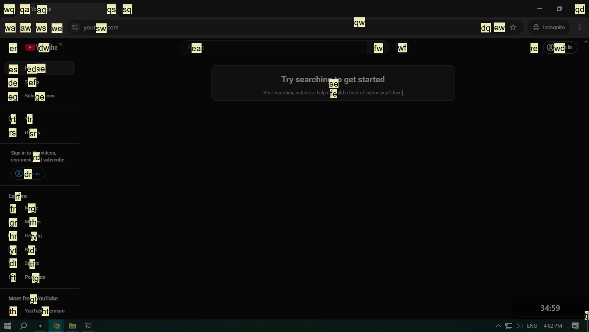

# ViMouse for Windows

A simple utility for Windows that provides Vim-style, keyboard-based mouse control.

This project was inspired by [garywill/vimouse](https://github.com/garywill/vimouse) for Linux. I created this version to solve my own need for a similar tool on Windows.

## Project Status

**This is a completed personal project and is no longer in active development.**

It was written to solve a specific problem and served its purpose well. The code is a "workbench prototype" — it's not perfectly clean, but **it works**.

## Features

-   **Keyboard-driven mouse control:** Click anywhere on the screen without touching the mouse.
-   **Grid-based targeting:** Use two-letter coordinates for precise clicks.
-   **Scroll simulation:** Scroll up and down with simple hotkeys.

### Default Hotkeys

| Key Combination | Action                   |
| :-------------- | :----------------------- |
| <kbd>Alt</kbd>+<kbd>&#92;</kbd> | Toggle targeting overlay |
| <kbd>Alt</kbd>+<kbd>K</kbd>     | Scroll Up              |
| <kbd>Alt</kbd>+<kbd>J</kbd>     | Scroll Down            |
| <kbd>Alt</kbd>+<kbd>Q</kbd>     | Exit Application       |

## Installation & Usage

There are two ways to run this application:

### For Users (Recommended)
This method uses a simple script to set everything up for you.

**Prerequisites:**
-   Windows 10 or higher
-   Python 3.9+ (must be in your system's PATH)
-   `uv` installed

**Steps:**
1.  Download and unzip the source code.
2.  Run `setup.bat`.

The script will install dependencies and create shortcuts for your desktop and Windows startup.

### For Developers
This method is for running directly from source using [uv](https://github.com/astral-sh/uv).

**Prerequisites:**
-   Python 3.9+
-   `uv` installed

**Steps:**
1.  **Clone:** `git clone https://github.com/slaid098/vimouse_win32 && cd vimouse_win32`
2.  **Sync:** `uv sync`
3.  **Run:** `uv run python main.py`

## Uninstallation
If you used `setup.bat`, you can uninstall by:
1.  Removing the desktop shortcut.
2.  Removing the startup shortcut (`%APPDATA%\Microsoft\Windows\Start Menu\Programs\Startup\ViMouse.lnk`).
3.  Deleting the application folder.

## License

This project is licensed under the [GNU General Public License v3.0](LICENSE).

Like the original project, this license ensures that any improvements to this tool remain free and open for the entire community.

Copyright (c) 2024 slaid098
